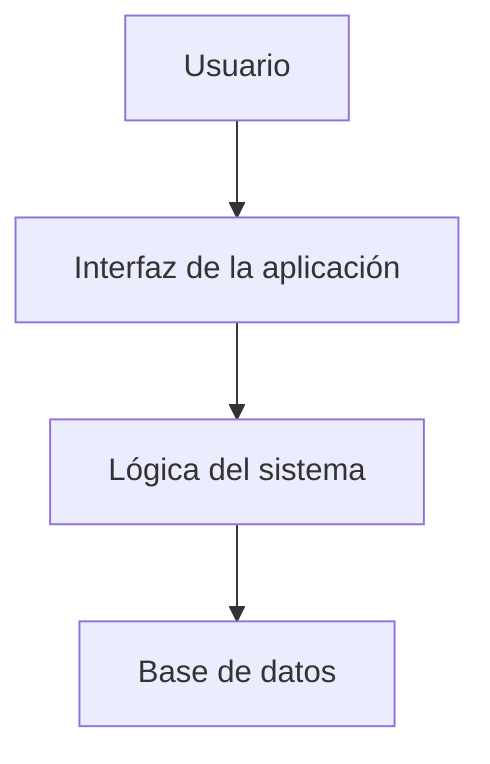

# Biblioteca Fácil

Biblioteca Fácil es una aplicación diseñada para organizar libros y facilitar su búsqueda y gestión.
Permite consultar libros, registrar usuarios y controlar los préstamos de manera sencilla.


## Tabla de contenidos

- [Descripción](#descripción)
- [Instalación](#instalación)
- [Uso](#uso)
- [Funcionalidades](#funcionalidades)
- [Arquitectura](#arquitectura)
- [Tareas pendientes](#tareas-pendientes)
- [Contribuidores](#contribuidores)

## Descripción

Biblioteca Fácil permite gestionar información básica de libros, usuarios y préstamos. El proyecto está pensado para facilitar la organización de una biblioteca pequeña y mejorar el acceso a la información.

## Instalación

Para instalar el proyecto, sigue estos pasos:

```bash
git clone https://github.com/marcoquinta-art/laboratorio-readme.git
cd laboratorio-readme
npm install
```

## Uso

Para utilizar la aplicación, inicia el proyecto con el siguiente comando:

```bash
npm start
```

Desde la aplicación puedes consultar libros, registrar usuarios y gestionar préstamos.

## Funcionalidades

| Funcionalidad       | Estado           |
| ------------------- | ---------------- |
| Buscar libros       | ✅ Completado    |
| Registrar usuarios  | ✅ Completado    |
| Gestionar préstamos | 🚧 En desarrollo |
| Generar reportes    | ⏳ Pendiente     |

## Tareas pendientes

- [ ] Agregar sistema de notificaciones.
- [ ] Implementar generación de reportes.
- [ ] Mejorar el diseño de la interfaz.
- [ ] Realizar pruebas finales.

## Arquitectura

El proyecto utiliza una estructura sencilla en la que el usuario interactúa con la aplicación, la cual se comunica con la lógica del sistema y la base de datos.



## Contribuidores

| Nombre                        | GitHub                                                 |
| ----------------------------- | ------------------------------------------------------ |
| Marco Antonio Quinta Quintana | [@marcoquinta-art](https://github.com/marcoquinta-art) |
|                               |                                                        |
